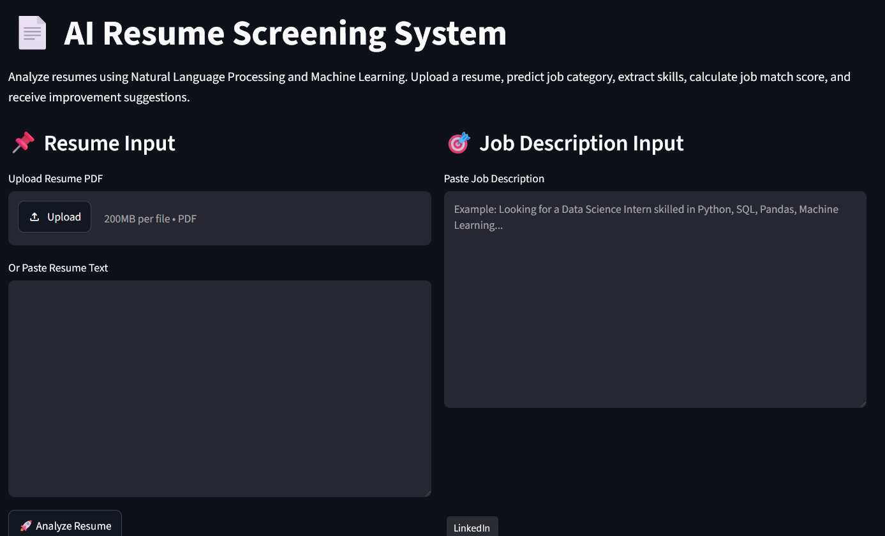
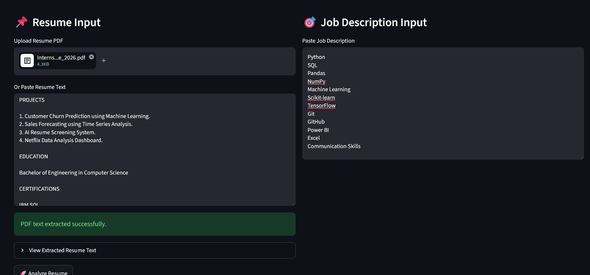
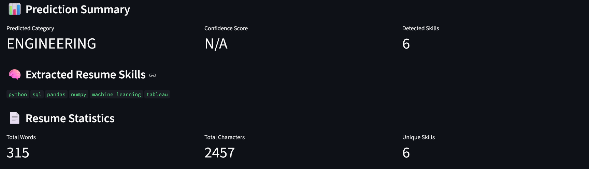
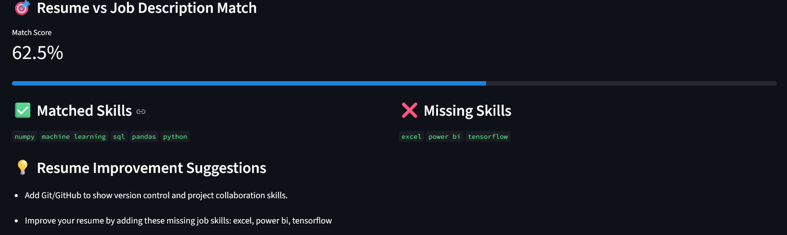

# 🤖 AI Resume Screening System

<div align="center">

# 📄 AI Resume Screening System

### AI-Powered Resume Analysis using Natural Language Processing (NLP), Machine Learning, and Streamlit

<p align="center">

[](https://www.python.org/)
[](https://ai-resume-screening-kamal26.streamlit.app/)
[](https://scikit-learn.org/)
[](LICENSE)

</p>

### 🌐 Live Application

**https://ai-resume-screening-kamal26.streamlit.app/**

---

**An end-to-end Machine Learning project that automatically analyzes resumes, predicts job categories, extracts technical skills, compares resumes with job descriptions, and generates intelligent resume improvement suggestions.**

</div>

---

# 📖 Introduction

Recruiters often spend only a few seconds reviewing each resume before deciding whether a candidate moves forward in the hiring process. Manual resume screening becomes increasingly difficult when organizations receive hundreds or thousands of applications for a single position.

The **AI Resume Screening System** addresses this challenge by using **Natural Language Processing (NLP)** and **Machine Learning** to automate the resume analysis process.

The application enables users to:

* Upload a resume in PDF format
* Paste resume text directly
* Predict the most suitable job category
* Extract technical skills automatically
* Compare resumes with job descriptions
* Calculate a resume-job compatibility score
* Generate personalized resume improvement suggestions

This project demonstrates the complete Machine Learning workflow—from data preprocessing and exploratory data analysis to model training, evaluation, and deployment using Streamlit.

---

# 🎯 Project Objectives

The primary objectives of this project are:

* Automate resume screening using Machine Learning.
* Reduce manual effort during the hiring process.
* Improve resume evaluation through NLP.
* Provide personalized resume feedback.
* Demonstrate a complete end-to-end ML pipeline suitable for real-world applications.

---

# ✨ Key Features

## 📄 Resume Upload

* Upload PDF resumes.
* Paste resume text manually.

---

## 🤖 Resume Classification

Automatically predicts the most suitable career category based on resume content.

Example categories include:

* HR
* Data Science
* Information Technology
* Engineering
* Banking
* Healthcare
* Finance
* Sales
* Teacher
* Designer
* Business Development

and many more.

---

## 🧠 NLP-Based Resume Processing

The system performs:

* Lowercase conversion
* Special character removal
* Stopword removal
* Lemmatization
* Text normalization

---

## 🏷 Technical Skill Extraction

Automatically identifies technologies mentioned in the resume such as:

Programming

* Python
* Java
* C++
* SQL

Frameworks

* TensorFlow
* PyTorch
* Scikit-Learn
* Streamlit
* FastAPI

Databases

* MySQL
* PostgreSQL
* MongoDB

Cloud

* AWS
* Azure
* GCP

Development Tools

* Git
* GitHub
* Docker

---

## 🎯 Resume vs Job Description Matching

The application compares resume skills with job requirements and provides:

* Resume Match Score
* Matched Skills
* Missing Skills

---

## 💡 Resume Improvement Suggestions

Provides recommendations such as:

* Missing technologies
* Missing technical skills
* Resume length improvements
* Additional learning recommendations

---

## 📈 Exploratory Data Analysis

EDA includes:

* Category Distribution
* Resume Length Analysis
* Word Cloud Visualization
* Duplicate Detection
* Missing Value Analysis

---

## 🌐 Interactive Streamlit Dashboard

The web application provides:

* Modern UI
* PDF Upload
* Resume Text Input
* Job Description Input
* Skill Visualization
* Resume Feedback
* Match Score

---

# 🏗 System Architecture

```text
Resume PDF / Resume Text
           │
           ▼
     Text Extraction
           │
           ▼
      NLP Cleaning
           │
           ▼
     TF-IDF Vectorizer
           │
           ▼
 Linear SVM Classifier
           │
           ▼
Predicted Job Category
           │
           ▼
Skill Extraction
           │
           ▼
Job Description Matching
           │
           ▼
Resume Feedback
```

---

# 🛠 Technology Stack

## Programming Language

* Python

---

## Machine Learning

* Scikit-Learn
* TF-IDF Vectorizer
* Logistic Regression
* Multinomial Naive Bayes
* Linear Support Vector Machine (Linear SVM)

---

## Natural Language Processing

* NLTK
* Stopwords
* Lemmatization
* Regular Expressions (Regex)

---

## Data Processing

* Pandas
* NumPy

---

## Data Visualization

* Matplotlib
* WordCloud

---

## Deployment

* Streamlit

---

## Utilities

* Joblib
* PyPDF2

---

# 📊 Dataset Information

| Property                  |        Value |
| ------------------------- | -----------: |
| Total Resumes             |    **2,484** |
| Categories                |       **24** |
| Missing Values            |        **0** |
| Duplicate Records Removed |            ✅ |
| Text Preprocessing        | NLP Cleaning |

Dataset Source: Public Resume Dataset

---

# 📈 Exploratory Data Analysis

EDA performed includes:

* Dataset Overview
* Missing Value Analysis
* Duplicate Detection
* Resume Length Distribution
* Category Frequency Distribution
* Resume Word Cloud
* Resume Statistics

---

# 🤖 Machine Learning Pipeline

The project follows this workflow:

1. Load Dataset
2. Clean Resume Text
3. Remove Stopwords
4. Lemmatization
5. TF-IDF Vectorization
6. Train-Test Split
7. Train Multiple Models
8. Compare Model Performance
9. Save Best Model
10. Deploy Using Streamlit

---

# 📊 Model Comparison

| Model                   |   Accuracy |
| ----------------------- | ---------: |
| Logistic Regression     | **64.79%** |
| Multinomial Naive Bayes | **54.73%** |
| ⭐ Linear SVM            | **70.42%** |

### Best Model

**Linear Support Vector Machine (Linear SVM)**

Reason:

* Highest Accuracy
* Better Generalization
* Faster Prediction
* Suitable for Text Classification

---

# 📸 Application Screenshots

## 🏠 Home Page



---

## 📄 Resume Prediction



---

## 🎯 Job Matching



---

## 💡 Resume Feedback



---

# 📂 Project Structure

```text
AI_Resume_Screening_System
│
├── app.py
├── train_model.py
├── requirements.txt
├── README.md
├── LICENSE
│
├── assets/
│
├── data/
│
├── models/
│
├── notebooks/
│
└── src/
```

---

# 🚀 Installation

```bash
git clone https://github.com/Im-Kamall/AI-Resume-Screening-System.git

cd AI-Resume-Screening-System

pip install -r requirements.txt

python train_model.py

streamlit run app.py
```

---

# ▶️ How to Use

1. Launch the application.
2. Upload a resume PDF or paste resume text.
3. Optionally provide a job description.
4. Click **Analyze Resume**.
5. Review:

   * Predicted Category
   * Extracted Skills
   * Match Score
   * Missing Skills
   * Resume Improvement Suggestions

---

# 🚀 Live Demo

https://ai-resume-screening-kamal26.streamlit.app/

---

# 🗺 Roadmap

### Completed

* Resume Classification
* Skill Extraction
* PDF Upload
* Resume Matching
* Resume Feedback
* Machine Learning Pipeline
* Streamlit Deployment

### Planned

* Transformer-based Classification
* BERT Integration
* ATS Resume Scoring
* Resume Ranking
* Multi-language Support
* AI Interview Question Generator
* LLM-powered Resume Review

---

# 🤝 Contributing

Contributions are welcome.

If you would like to improve the project:

1. Fork the repository.
2. Create a new feature branch.
3. Commit your changes.
4. Open a Pull Request.

---

# 👨‍💻 Author

## Kamal Solanki

**GitHub**

https://github.com/Im-Kamall

**LinkedIn**

https://www.linkedin.com/in/kamalsolanki-dev

**Live Demo**

https://ai-resume-screening-kamal26.streamlit.app/

---

# 📜 License

This project is licensed under the **MIT License**.

See the **LICENSE** file for complete details.

---

<div align="center">

## ⭐ If you found this project useful, please give it a Star.

Thank you for visiting this repository!

</div>
